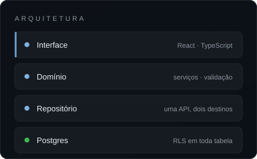

 

## Sobre

Escrevo código porque gosto — e porque é assim que fico bom no assunto.

Na prática isso virou o hábito de levar projetos até o fim, não até o ponto em
que funcionam na minha máquina. Um app só está pronto quando tem autenticação
de verdade, quando os dados de uma pessoa não vazam para outra, quando abre
rápido no celular de alguém e quando existe teste segurando o que já foi
consertado uma vez.

Aprendo construindo. Escolho um problema que eu mesmo teria, e vou até esbarrar
nas partes difíceis: modelagem de dados, política de acesso no banco, peso do
bundle, estado assíncrono. Foi assim que aprendi Row Level Security, e foi
assim que descobri que um `manualChunks` mal colocado pode triplicar o primeiro
acesso de um site.

Hoje trabalho principalmente com **React + TypeScript no front** e **Supabase
no back** — Postgres, autenticação e Edge Functions.

<!--
  ESPAÇO PARA GIF
  Solte um arquivo em assets/anime.gif e troque a linha acima por:
  
-->

## Atualmente

- **Construindo** — THealth, acompanhamento de saúde com o corpo em 3D no
  centro da tela.
- **Aprendendo** — Three.js e React Three Fiber a fundo: enquadramento de
  câmera, degradação de qualidade e orçamento de frame.
- **Explorando** — Deno nas Edge Functions do Supabase, e o que muda quando o
  mesmo código precisa rodar em Deno e em Node.

## Tecnologias

**Frontend**

**Dados e backend**

**Qualidade**

**Ferramentas**

## Projetos

### THealth

Centro pessoal de saúde organizado em torno de uma **representação 3D
interativa do corpo**, em vez de uma parede de cards.

*O problema:* aplicativos de saúde transformam o corpo numa planilha. Peso,
medidas e treinos viram linhas, e você perde a noção de onde aquilo está
acontecendo. Aqui as medidas apontam para a figura, como numa prancha
anatômica — clicar numa região mostra o que foi registrado ali.

Registra corpo, treino, hidratação e alimentação. A estimativa nutricional a
partir de foto é feita por IA e sempre apresentada como **intervalo, nunca como
número exato** — e todo campo que o modelo não sabe volta vazio em vez de
plausível.

Algumas decisões que valeram o trabalho:

- **`user_id` nunca vem do cliente.** Coluna com `DEFAULT auth.uid()`, policy
  validando, e a camada de repositório descartando o campo de qualquer patch —
  três barreiras para o mesmo invariante.
- **A chave da IA nunca chega ao navegador.** Um único núcleo compartilhado
  roda em três hospedagens diferentes, e só ele lê a chave.
- **206 kB no primeiro acesso.** A cena 3D e os gráficos chegam sob demanda; o
  canvas para de desenhar quando a aba sai de vista.
- **91 testes**, herméticos por construção — a suíte não consegue escrever em
  produção nem por acidente.

`React 18` `TypeScript` `Vite` `Tailwind` `Three.js` `React Three Fiber`
`Supabase` `Postgres + RLS` `Edge Functions (Deno)` `Vitest`

Repositório privado.

### JobPilot

CRM pessoal para busca de emprego: empresas, contatos, funil de prospecção,
mensagens, follow-ups e análises.

*O problema:* procurar vaga vira uma planilha caótica. Você não lembra quem já
respondeu, quando cobrar de novo, nem o que já mandou para quem.

A decisão que define o projeto: **nada é automático no LinkedIn.** Sem scraping,
sem automação de navegador, sem guardar credencial. O app gera a mensagem e
você cola — e ele só marca como enviada quando *você* confirma. Um app que
dissesse "enviado" só porque copiou estaria mentindo para o próprio usuário.

- **Geração de mensagens 100% local e determinística** — três variações por
  contato, sem chamada a modelo de linguagem.
- **Importação do CSV oficial de conexões**, com correspondência em cascata
  (URL normalizada → e-mail → nome+empresa → aproximação) e resolução linha a
  linha. Aproximação por nome nunca é aplicada sozinha.
- **Leitura de currículo local** — PDF e DOCX no navegador, com OCR sob demanda
  e revisão obrigatória antes de gravar.
- **Exportação CSV protegida contra CSV injection**, e RLS restrito a
  `auth.uid()` em toda tabela.
- **51 testes** cobrindo a lógica determinística.

`React 19` `TypeScript (strict)` `Vite` `Tailwind` `Supabase` `TanStack Query`
`dnd-kit` `Recharts` `pdf.js` `Tesseract.js` `PWA` `Vitest`

## Como eu trabalho

- **Segredo não mora no cliente.** Chave de API vive no servidor. Se está no
  bundle, está público — não importa quão ofuscado.
- **O banco é a última linha de defesa.** Validação no formulário é
  conveniência. RLS é o que de fato separa os dados de duas pessoas.
- **Peso é decisão de produto.** Quantos kB alguém baixa para ver a primeira
  tela é escolha, não consequência.
- **A interface não pode mentir.** Estimativa vem rotulada como estimativa.
  Erro diz o que fazer. Nada finge ter acontecido.

## GitHub

## Contato

<!-- Acrescente LinkedIn ou portfólio aqui quando quiser.
     O Simple Icons não serve mais o ícone do LinkedIn, então este badge é só texto:

-->

